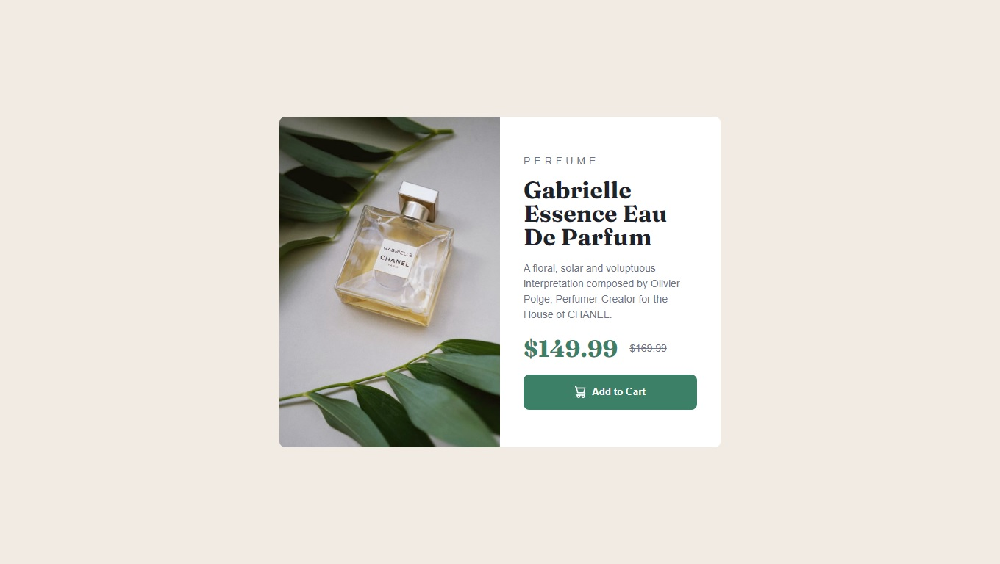
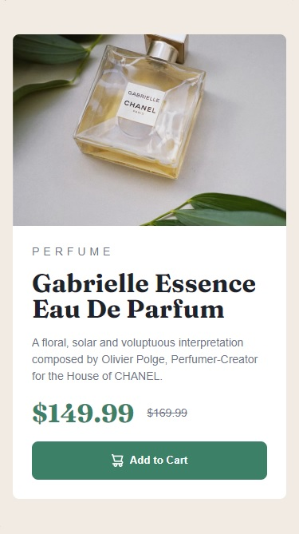

# Frontend Mentor - Product preview card component solution

This is a solution to the [Product preview card component challenge on Frontend Mentor](https://www.frontendmentor.io/challenges/product-preview-card-component-GO7UmttRfa). Frontend Mentor challenges help you improve your coding skills by building realistic projects. 

## Table of contents

- [Overview](#overview)
  - [The challenge](#the-challenge)
  - [Screenshot](#screenshot)
  - [Links](#links)
- [My process](#my-process)
  - [Built with](#built-with)
  - [What I learned](#what-i-learned)
  - [Useful resources](#useful-resources)
- [Author](#author)

## Overview

### The challenge

Users should be able to:

- View the optimal layout depending on their device's screen size
- See hover and focus states for interactive elements

### Screenshot
- Desktop

-Mobile


### Links

- Solution URL: [Repository](https://github.com/Jirosu/Product_preview_card_component)
- Live Site URL: [GitHub Pages](https://jirosu.github.io/Product_preview_card_component/)

## My process

### Built with

- Semantic HTML5 markup
- CSS custom properties
- Flexbox
- CSS Grid
- Mobile-first workflow
- BEM Methodology

### What I learned
For this challenge I applied several new things: CSS Custom Properties, Mobile-first workflow approach and BEM Methodology.

- Code snippet where I use BEM 
```html
<div class="card">
  ...
  <div class="card__content">
    <p class="card__category">Perfume</p>
    <h1 class="card__title">Gabrielle Essence Eau De Parfum</h1>
    ...
```

- ```<picture>``` and ```<source>``` tags allow me to change the image for the desktop and mobile layout based on the screen size.
```html
<picture>
  <source srcset="./images/image-product-desktop.jpg" media="(min-width: 600px)" class="card__img">
  
</picture>
```

- CSS Media Queries to switch to Desktop layout using CSS Grid.
```css
/* Desktop */
@media (min-width: 600px) {
  .card{
    display: grid;
    grid-template-columns: 1fr 1fr;
  }
  .card__content{
    padding: 2rem;
  }
}
```

### Useful resources

- [BEM CHEAT SHEET](https://bem-cheat-sheet.9elements.com/) - This web has examples and suggestions on how to name components using the BEM methodology.
- [Battling BEM CSS: 10 Common Problems And How To Avoid Them](https://www.smashingmagazine.com/2016/06/battling-bem-extended-edition-common-problems-and-how-to-avoid-them/) - This article provide tips that helped me to understand how to applied the BEM methodology and avoid common mistakes.

## Author

- Frontend Mentor - [@Jirosu](https://www.frontendmentor.io/profile/Jirosu)